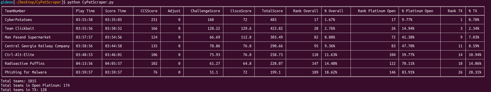

## CyberPatriot Scoreboard Scraper ##
Used for displaying team information from the CyberPatriot competition's live [scoreboard](https://scoreboard.uscyberpatriot.org/index.php?sort=Total).

### Example ###
A terminal should produce an output such as this:


### Getting Running ###
The Python modules `Beautiful Soup 4`, `Requests`, and `Tabulate` are required to run.

If using pip, run the following:
```
pip install bs4
pip install requests
pip install tabulate
``` 

Configure Team IDs before launching.
